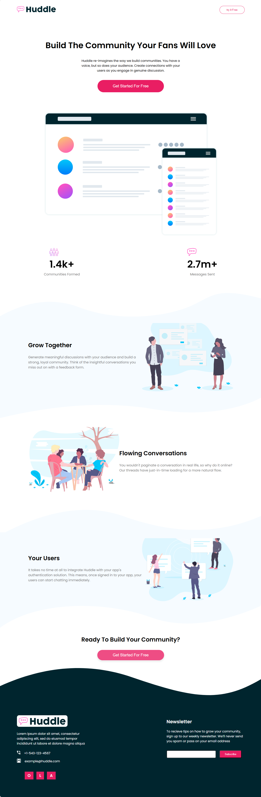

# Frontend Mentor - Huddle landing page with curved sections

This is a solution to the [Huddle landing page with curved sections](https://www.frontendmentor.io/challenges/huddle-landing-page-with-curved-sections-5ca5ecd01e82137ec91a50f2). Frontend Mentor challenges help you improve your coding skills by building realistic projects.

## Table of contents

- [Overview](#overview)
  - [The challenge](#the-challenge)
  - [Screenshot](#screenshot)
  - [Links](#links)
- [My process](#my-process)
  - [Built with](#built-with)
  - [What I learned](#what-i-learned)
  - [Continued development](#continued-development)
- [Author](#author)
- [Acknowledgments](#Acknowledgments)

## Overview

### The challenge

Practice using pseudo-elements for styling extras and the CSS position property for the sections with curved edges.

Your users should be able to:

- View the optimal layout for the interface depending on their device's screen size
- See hover and focus states for all interactive elements on the page

### Screenshot

### Links

- Solution URL: [here](https://github.com/olahasan/HTML_AND_CSS_Frontend-Mentor_JUNIOR-Huddle-landing-page-with-curved-sections)

- Live Site URL: [here](https://olahasan.github.io/HTML_AND_CSS_Frontend-Mentor_JUNIOR-Huddle-landing-page-with-curved-sections/)

## My process

### Built with

- Semantic HTML5 markup
- CSS custom properties
- Flexbox
- CSS Grid
- Mobile-first workflow

### What I Learned

In this project, I learned how to:

- Use CSS pseudo-elements to create curved sections.
- Implement responsive design using media queries.
- Utilize Flexbox for layout management.
- Apply CSS variables for maintaining consistent styling.

### Continued Development

In future projects, I plan to:

- Explore more advanced CSS techniques.
- learn, Improve my JavaScript skills to add interactivity.
- Experiment with CSS animations and transitions.

### Author

Frontend Mentor - @olahasan 
GitHub - @olahasan

### Acknowledgments

Thanks to **Frontend Mentor** for providing this challenge and to the community for their support and feedback
